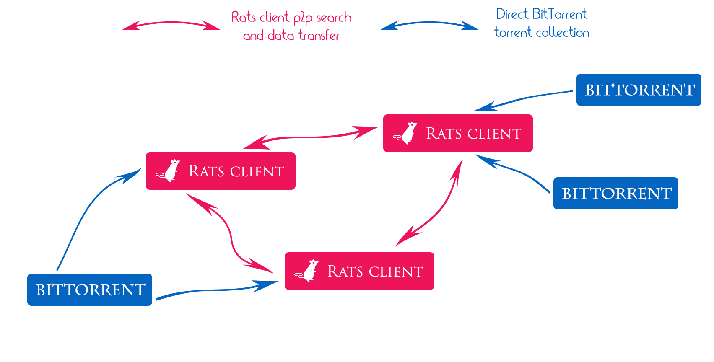
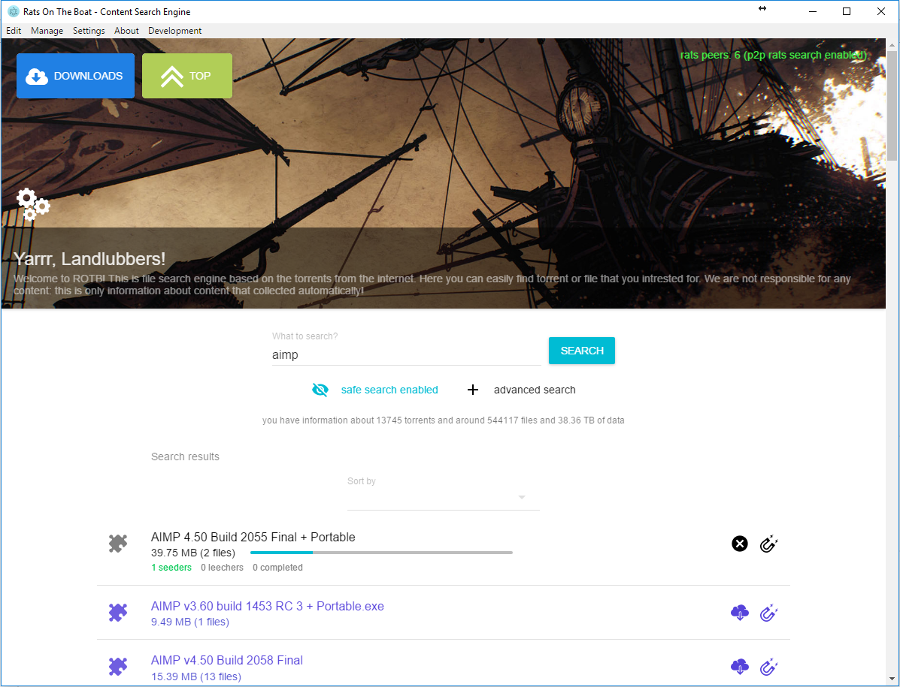

# Rats on The Boat - BitTorrent search engine

<p align="center"><a href="https://github.com/DEgiTx/rats-search"></a></p>

[](https://circleci.com/gh/DEgITx/rats-search)
[](https://ci.appveyor.com/project/DEgITx/rats-search)
[](https://travis-ci.org/DEgITx/rats-search)
[](https://github.com/semantic-release/semantic-release)
[](https://github.com/DEgITx/rats-search/releases)
[](https://github.com/DEgITx/rats-search/blob/master/docs/MANUAL.md)

BitTorrent search program for desktop and web. Collect and navigate over base of torrents statistic, categories, and give easy access to it. Work over p2p network and support Windows, Linux, Mac OS platforms.

## Features
* Works over p2p torrent network, doesn't require any trackers
* Supports own p2p protocol for additional data transfer (like search between rats clients, descriptions/votes transfer, etc.)
* Search over torrent collection
* Torrent and files search
* Search filters (size ranges, files, seeders etc...)
* Collection filters (regex filters, adult filters)
* Trackers peers scan supported
* Integrated torrent client
* Collect only statistic information and don't save any torrents internal data
* Supports torrents rating (voting)
* P2P Search protocol. Search in other Rats clients.
* Web version (web interface) for servers
* Top list (mostly common and popular torrents)
* Feed list (Rats clients activity feed)
* Translations: English, Russian, Ukrainian, Chinese
* Drag and drop torrents (expand local search database with specific torrents)
* Descriptions association from trackers
* Torrent generation and automatic adding to search DB
* [WebSockets & REST API for server/search engine. You can made search request and create your own UI client.](docs/API.md)

## Architecture


## Contributing
We are welcome any contributing: bug fixes, improvements, code refactoring and other stuffs.

[Translation guide](docs/TRANSLATION.md)

[Own strategy / Other tracker support](docs/TRACKERS.md)

## Usage Manuals
* [English](docs/USAGE.md)
* [Russian](docs/USAGE.RU.md)

## Download Desktop client
By default we recomended using desktop version of application. [<b>Download and install most recent one</b>](https://github.com/DEgITx/rats-search/releases) for Windows, MacOS, Linux. 

### Start desktop client from master branch
Clone repository with submodules:
```bash
git clone --recurse-submodules https://github.com/DEgITx/rats-search.git
```

Then make sure that you have Node.js and NPM (with Node.js) installed in your system, then install all needed packages:

```bash
npm install --force
```
and start master develop branch version:
```bash
npm start
```

## Server webUI version installation
Beside default desktop cross-platform client, also exist separated webUI that can run from server independant as web-client + Node.JS server.

Clone repository, then make sure that you have Node.js and NPM (with Node.js) installed in your system, then:

```bash
npm install --force
```

Then compile web version:

```bash
npm run buildweb
```

Finally start server application:

```bash
npm run server
```

Now you can get access to web interface on 8095 port: http://localhost:8095

[More about configuration](docs/SERVER.md)

[More about server compatibility and known issues](docs/SERVER_COMPATIBILITY.md)

[API usage implementation for clients](docs/API.md)

## Docker image

You can simply run docker image with prepared server version. Just download last sources:

```bash
git clone --recurse-submodules https://github.com/DEgITx/rats-search.git
```

And build docker image & run:

```bash
docker build -t rats-search:latest rats-search
docker run -p 8095:8095 rats-search:latest
```

Now you can check the and open http://localhost:8095/ in browser

## Donation

[**Support Rats Search development on OpenCollective**](https://opencollective.com/RatsSearch)

## Contacts / Support

- Twitter: [@RatsSearch](https://twitter.com/RatsSearch)
- [Discord (Support)](https://discord.gg/t9GQtxA)

## Screenshots



## License
[MIT](https://github.com/DEgiTx/rats-search/blob/master/LICENSE)
