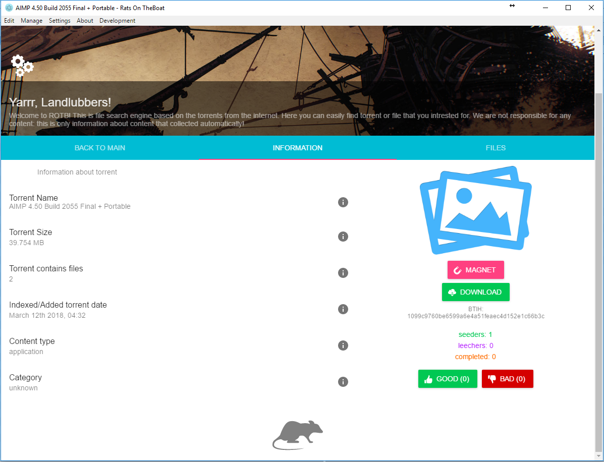

# Rats on The Boat - BitTorrent search engine

<p align="center"><a href="https://github.com/DEgiTx/rats-search"></a></p>

[](https://circleci.com/gh/DEgITx/rats-search)
[](https://ci.appveyor.com/project/DEgITx/rats-search)
[](https://travis-ci.org/DEgITx/rats-search)
[](https://github.com/semantic-release/semantic-release)
[](https://github.com/DEgITx/rats-search/releases)
[](https://github.com/DEgITx/rats-search/blob/master/docs/MANUAL.md)

BitTorrent search program for desktop and web. Collect and navigate over base of torrents statistic, categories, and give easy access to it. Work over p2p network and support Windows, Linux, Mac OS platforms.

## Features
* Works over p2p torrent network, doesn't require any trackers
* Search over torrent collection
* Torrent and files search
* Search filters
* Trackers peers scan supported
* Integrated torrent client
* Pretty safe to use and don't send any information about collected torrents data (statistic)
* Collect only statistic information and don't save any torrents internal data
* Supports torrents rating (voting)
* P2P Search. Search in other Rats clients.
* Web version (web interface) for servers
* Torrents top list

## Architecture


## Contributing
We are welcome any contributing: bug fixes, improvements, code refactoring and other stuffs.

## Usage Manuals
* [English](docs/USAGE.md)
* [Russian](docs/USAGE.RU.md)

## Server version install
Clone repository, then make sure that you have Node.js and NPM (with Node.js) installed in your system, then:

```bash
npm install
```

Then compile web version:

```bash
npm run buildweb
```

Finally start server application:

```bash
npm run server
```

Now you can get access to web interface on 8095 port: http://localhost:8095

[More about configuration](docs/SERVER.md)

[More about server compatibility](docs/SERVER_COMPATIBILITY.md)

## Screenshots




## Donation

## License
[MIT](https://github.com/DEgiTx/rats-search/blob/master/LICENSE)
