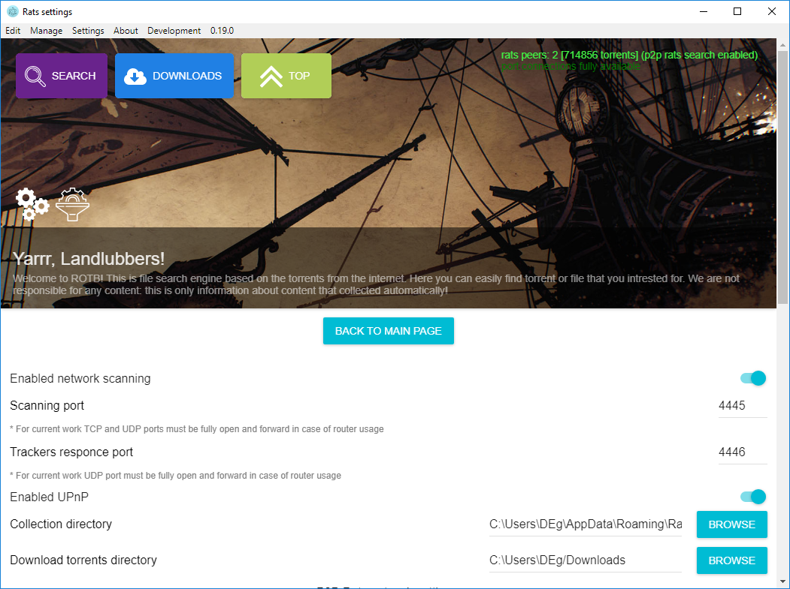
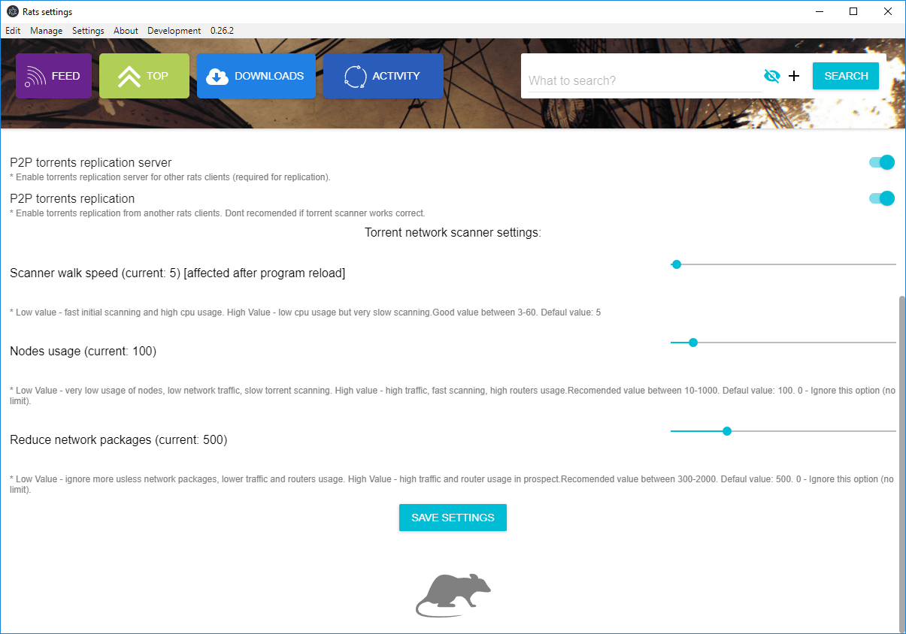

## Использование

После инсталляции программы и запуска вам должно быть доступно основное окно программы:

После старта, изначально у вас нету базы поиска. Можно использовать готовые базы поиска, предварительно скопировав их в папку с настройками. 

Сбор новых торрентов из сети должен начаться автоматически через минуту-две после запуска программы (в случае корректно открытых портов). 
Это можно отслеживать в поле "you have information about X торрент", а так же в списке поступления торрентов под ним. Скорость сбора торрентов будет увеличиваться с течением времени.

В случае, если сбор торрентов не происходит, или идет очень-очень медленно (по 1-2 торренту в несколько минут), следует удостовериться что открыты порты, указанные в настройках. Об этом в следующем пункте.

### Настройка портов

Для корректной работы, необходимо чтобы были открыты порты 4445 и 4446 (или другие, указанные в настройках). Должны быть открыты оба типа портов (UDP и TCP). На роутере порты обязательно должны быть проброшены через NAT (если таковой включен). В случае, если ваш роутер поддерживает UPnP, порты будут проброшены автоматически и, в принципе, делать ничего не нужно.

### Использование поиска

С течением времени ваша база торрентов естественным путем будет расти, и вы можете искать интересующий вас торрент, используя поиск выше.

### Распределенный поиск

В случае нахождения других клиентов ROTB, о чем сигнализирует индикатор в верхней части

вам будет доступен расширенный поиск среди других клиентов ROTB, для этого вам нужно выполнить обычный поиск, однако будут отображены дополнительные результаты выдачи. Результат расширенной выдачи может изменяться в зависимости от количества пиров и именно тех, кого нашло.

Результаты выдачи других участников помечаются отдельным цветом.

### Настройка сканнера торрентов

В настройках есть 3 параметра, отвечающих за настройку поиска торрентов в сети, каждый из них влияет на нагрузку приложения, скорость сбора торрентов, генерацию траффика, а так же на общую нагрузку на оборудование промежуточных узлов сети (роутера и т.п.)

Рекомендованные значения:
* Максимально быстрый поиск / высокая нагрузка:
  * Скорость прохода: 5
  * Использование узлов: 0 (отключен = максимальное использование)
  * Сократить количество сетевых пакетов: 0 (отключено = неограниченно)
* Средняя скорость поиска / средняя нагрузка:
  * Скорость прохода: 15
  * Использование узлов: 100
  * Сократить количество сетевых пакетов: 600
* Низкая скорость поиска / средняя нагрузка:
  * Скорость прохода: 30
  * Использование узлов: 10
  * Сократить количество сетевых пакетов: 450
