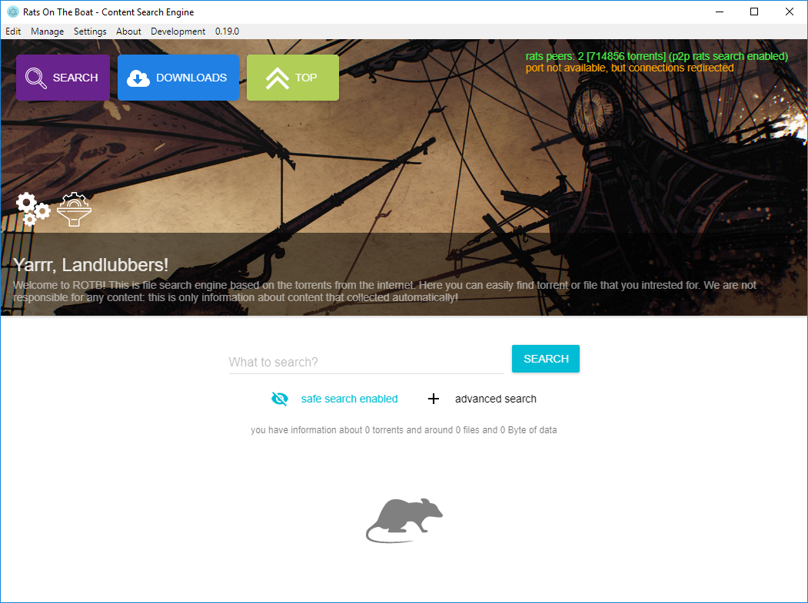
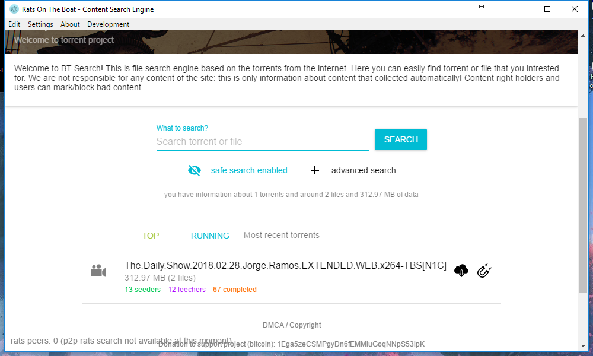
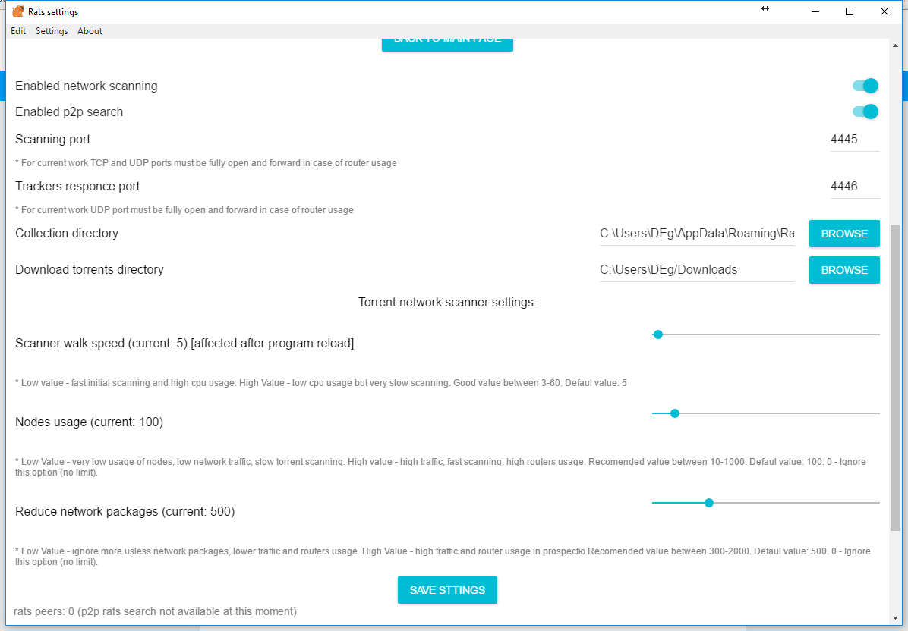
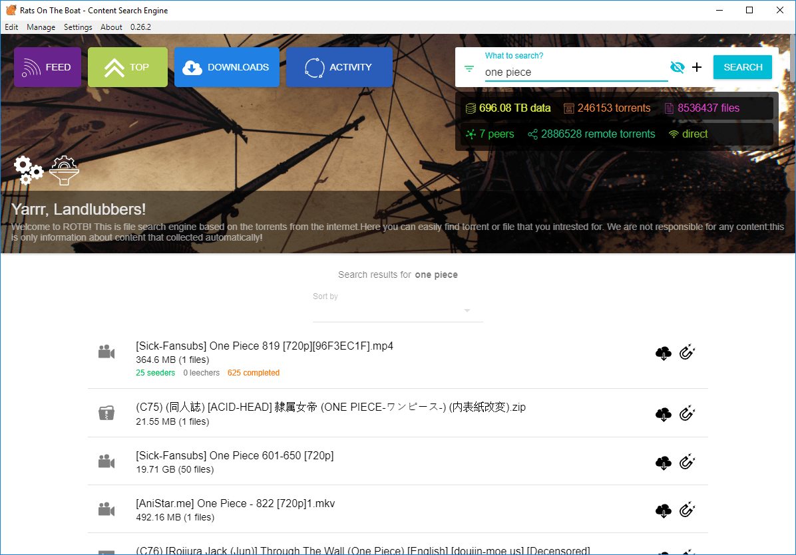
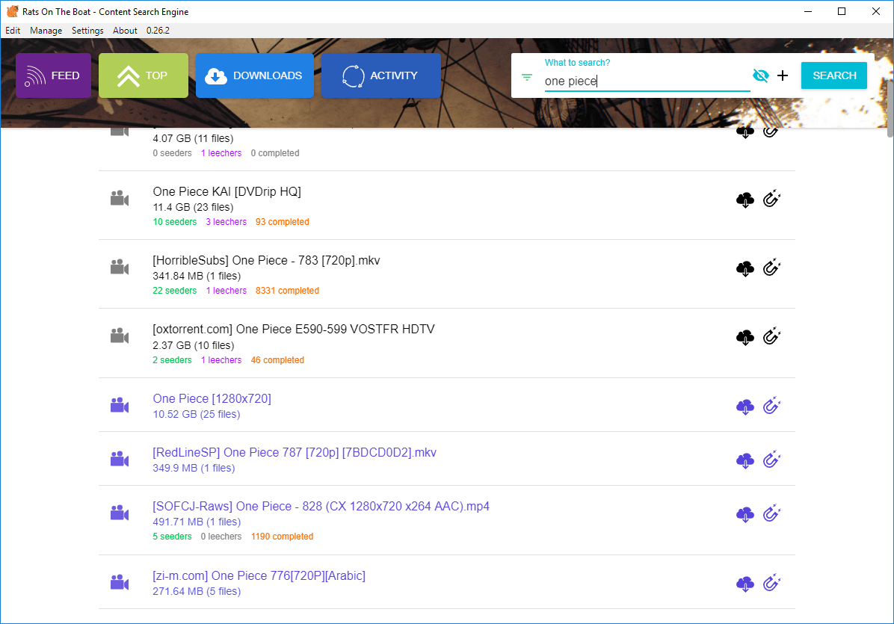

## Использование

После инсталяции программы и запуска вам должно быть доступно основное окно программы:

После старта, изначально у вас нету базу поиска. Можно использовать готовые базы поиска, предварительно скопировав их в папку с настройками. 

Сбор новых торрентов из сети должен начаться автоматически,через минуту-две после запуска программы (в случае корректно открытых портов). 
Это можно отслеживать в поле "you have information about X торрент", а так же в списке поступления торрентов под ним. Скорость сбора торрентов будет увеличиваться с течением времени.

В случае если сбор торрентов не происходит, или идет очень очень медленно (по 1-2 торренту в несколько минут), еследует удостовериться что порты указанные в настройках открыты. Об этом в следующем пункте.

### Настройка портов

Для корректной работы, необходимо чтобы были открыты порты 4445 и 4446 (или другие указанные в настройках). Должны быть открыты оба типа порта (UDP и TCP). На роутере порты обязательно должны быть проброшены через NAT (если таковой включен). В случае если ваш роутер поддерживает UPnP порты будут проброшены автоматически и, впринципе, делать ничего не нужно.

### Использование поиска

С течением времени ваша база торрентов естественным путем будет расти, и вы можете искать интересующий вас торрент используя поиск выше

### Распределенный поиск

В случае найденных других клиентов ROTB о чем сигнализирует индикатор в нижней части

Вам будет доступен расширенный поиск среди других клиентов ROTB, для этого вам нужно выполнить обычный поиск, однако будут отображены дополнительные результаты выдачи. В зависимости от количества пиров и именно тех кого нашло результат расширенной выдачи может изменяться.

Результаты выдачи других участников помечаются отдельным цветом.

### Настройка сканнера торрентов

В настройках есть 3 параметра отвечающих за настройку поиска торрентов в сети, каждый из них влияет на нагрузку приложения, скорость сбора торрентов, генерацию траффика а так же общую нагрузку на оборудывание промежуточных узлов сети (роутера и т.п.)

Рекомендованные значения:
* Максимально быстрый поиск / высокая нагрузка:
  * Scanner walk speed: 5
  * Nodes usage: 0 (отключен = максимальное использование)
  * Reduce network packages: 0 (отключено = неограниченно)
* Средняя скорость поиска / средняя нагрузка:
  * Scanner walk speed: 15
  * Nodes usage: 100
  * Reduce network packages: 600
* Низкая скорость поиска / средняя нагрузка:
  * Scanner walk speed: 30
  * Nodes usage: 10
  * Reduce network packages: 450
